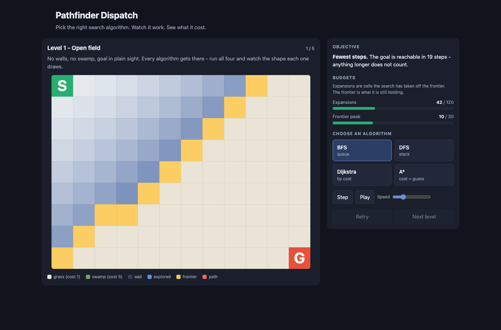
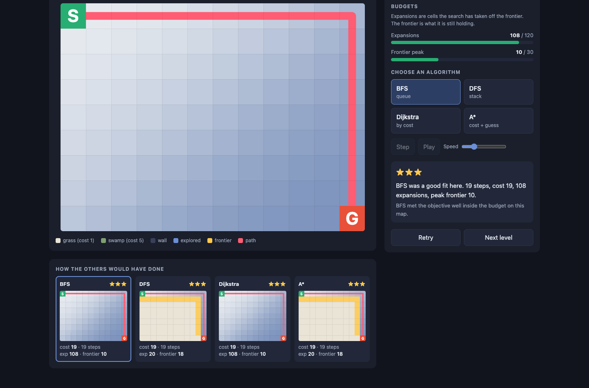
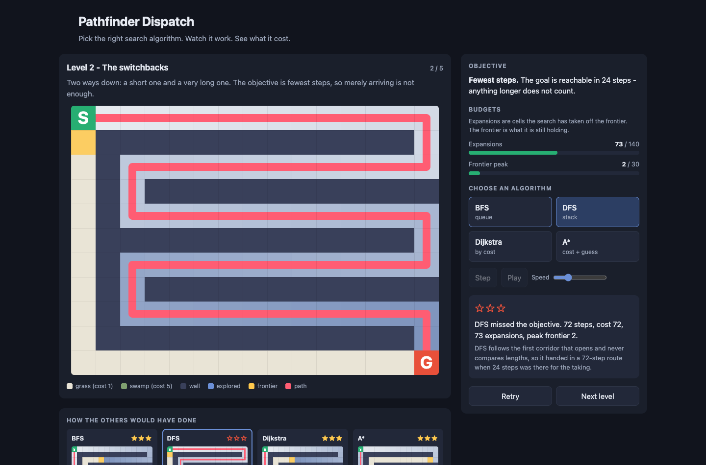
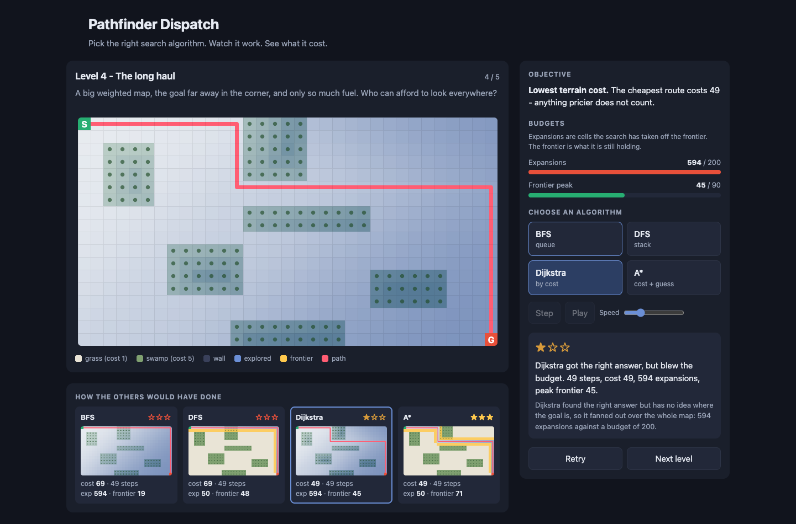
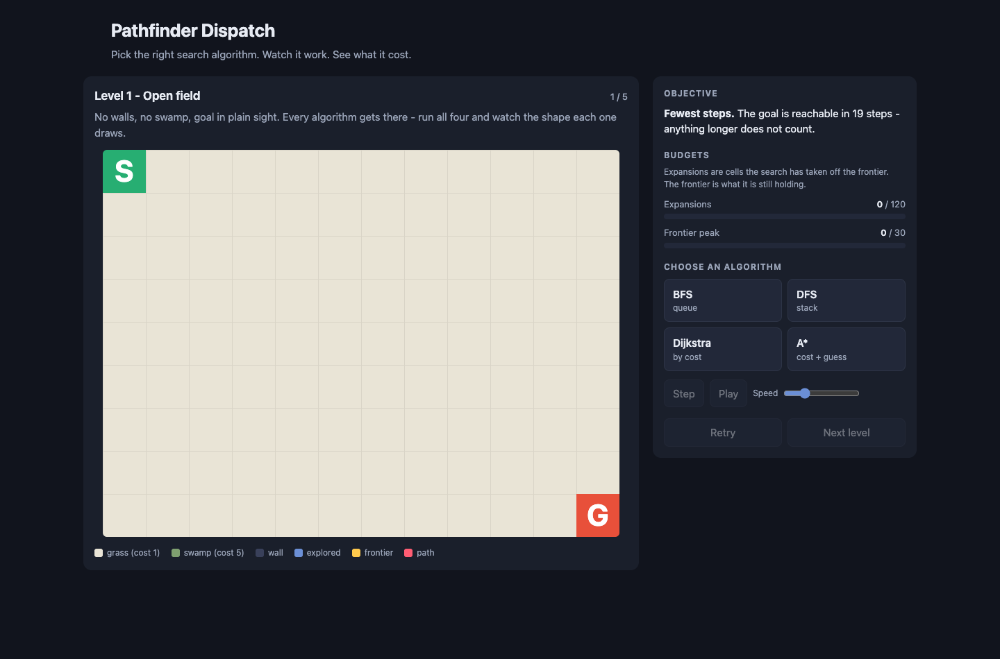
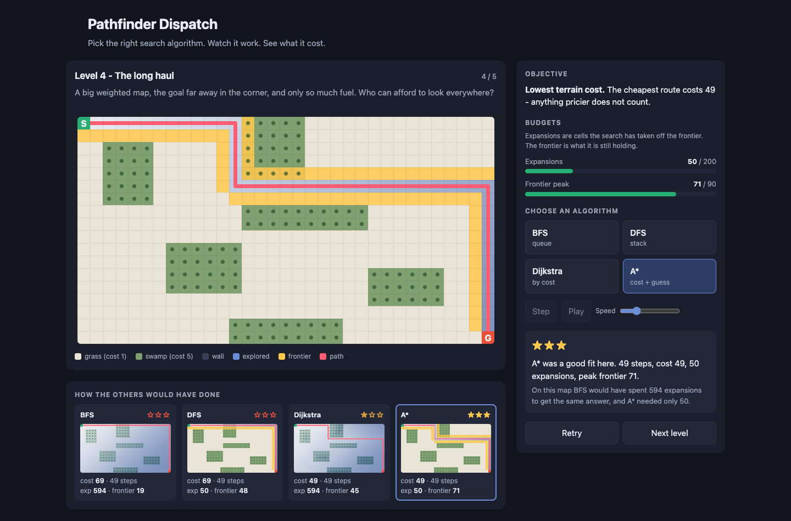
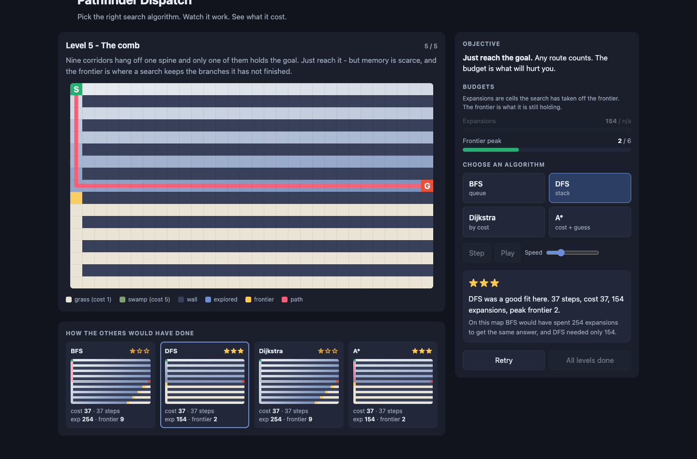
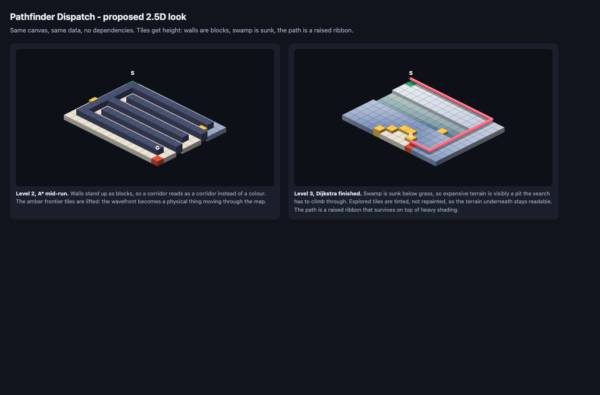

# Pathfinder Dispatch - Vision

A design review of the merged MVP, played end to end in Chrome from `localhost` and from `file://`, and the concept it should grow into.
Written from the chair of a puzzle / edu-game designer, not a code reviewer.
Screenshots in `docs/vision/` are all from the merged MVP unless the caption says otherwise.

## The promise

Pathfinder Dispatch promises that you can *feel* the difference between four ways of searching a map.
You are a dispatcher with a map, a delivery to make, and less fuel and less memory than you would like.
You commit to a strategy before you know how it ends, watch it spend your budget in real time, and then get told, in one sentence, what that strategy bought you and what it cost.
The payoff is not "the path was found" - a computer does that in a millisecond and nobody learns anything.
The payoff is the moment you realise that the algorithm that always felt smartest just ran you out of memory, and that a dumber one would have walked home fine.
When it lands, a student stops memorising four names and starts reasoning about trade-offs, which is the only thing about search worth keeping five years later.

## What the MVP does well

**The wavefront is genuinely beautiful.**
The amber frontier moving diagonally across the field, with exploration order shaded behind it, is the single best thing in the build.
It makes "the frontier" a thing you can point at rather than a word in a lecture.

**The compare strip is the real teaching instrument.**
Showing what the other three would have done, on the same map, with the same stats, is what turns one run into a lesson.
No other free pathfinding visualiser I know of does the counterfactual by default.

**Level 2 produces an actual gasp.**
DFS snaking through every switchback and handing in a 72-step route against a 24-step optimum is a picture of an idea.
The verdict sentence underneath it is the best writing in the game.

**Level 4 makes cost visible.**
Dijkstra flooding the whole map while A\* walks almost straight to the goal is the clearest contrast in the build, and the budget bar going red is the only moment with any tension in it.

**The engineering is honest.**
No dependencies, no build, plays identically from `file://` and from `python3 -m http.server`, zero console errors on every level, and `tools/verify-levels.js` proves the budgets still match the design table.
That is a rare and valuable base to build on.

## Where it falls flat

**It is a simulation, not a game.**
This is the captain's verdict after playing it and it is correct.
The player has exactly one verb - pick one of four buttons - exercised once per level, five times in the whole product.
There is no scarcity, no sequence, no consequence, and nothing carried from one level to the next.
Everything after the click is watching.

**The first minute has nothing at stake.**
Level 1 is a blank beige field where all four algorithms score three stars.
The opening screen is roughly 60% empty grid with no character, no story, and no reason to prefer any button.

**A\* feels like the answer to every question.**
It is not actually true in the data - A\* ties on levels 1, 2 and 5 - but perception is what matters, and nothing in the game ever punishes A\* for its real weakness.
Its frontier is the *largest* of the four on the big maps: 71 cells on level 4 against Dijkstra's 45, and 18 against BFS's 10 on level 1.
The game never once charges A\* for that, so the player correctly concludes that the informed algorithm is strictly better and stops thinking.

**The run is over before you can watch it.**
At the default speed the level 1 animation lasts about two seconds.
There is no marker for the cell being expanded right now, so the "moment to moment" is a blur rather than a heartbeat.

**The finished frame hides the lesson.**
At the end of a run the leftover frontier is still painted at 85% opacity on top of everything, so A\*'s signature teardrop is buried under a yellow smear, and the four compare cards use different dominant colours for the same outcome.
This is the most damaging visual defect in the build: the shape each algorithm draws is the whole point of the compare strip.

**Nothing is kept and nothing is gated.**
Stars vanish on reload, "Next level" is enabled after a zero-star failure, there is no level select, no star total, and the last screen is a disabled button reading "All levels done".
A player who fails every level reaches the same ending as one who three-stars the game.

**The vocabulary is never taught.**
"BFS / queue" is four characters and a word that mean nothing to a student who has not had the lecture yet, and the verdicts never name the concept being demonstrated: optimality, admissibility, weights, memory.
The game teaches the intuition and then fails to hand over the words that make the intuition portable to an exam or an interview.

**Smaller things worth fixing while nearby.**
On a 1280x720 laptop the goal tile and the legend sit below the fold on first load.
When a level has only one budget the other still renders as a dimmed "254 / n/a", which reads like a bug.
The keyboard controls (space, arrow) exist but are never mentioned.
Nothing ever tells the player that the frontier is a queue in one algorithm and a stack in another, which is the mechanism the whole game is about.

## Retention audit: what stops people playing

Played as a gamer rather than as a reviewer, the build runs about six minutes and ends in one sitting, and nothing in it asks for a second.
These are the reasons, in the order they cost players, each with the fix and the roadmap box that closes it.

**R1. The first minute has nothing to lose.**
Level 1 is an empty field where all four algorithms score three stars, so the opening decision is not a decision.
A player who learns in minute one that the choice does not matter has been taught the wrong lesson about the whole game.
*Fix:* give the tutorial at least one wrong answer and put the dispatch framing on the opening screen.
*Roadmap:* "Level 1 earns its place".

**R2. The only verb is "pick one of four, then watch".**
Agency ends about three seconds into a level and never comes back; everything after the click is a cutscene.
Games that hold people alternate decision and consequence on a tight loop, and this one has a ratio of one decision to one level.
*Fix:* legs, so a run is four decisions with four consequences.
*Roadmap:* "Legs: one level, several waypoints, one algorithm choice per leg".

**R3. A\* is a dominant strategy, so thinking stops at level 4.**
Once a player finds a button that never gets punished, the remaining levels are administration.
A\* actually holds the largest frontier of the four on the big maps, and the game never charges it for that.
*Fix:* constraint archetypes where a heuristic is unavailable, lying, or unaffordable, and a card economy that rations A\*.
*Roadmap:* "Three constraint archetypes that beat A\*", "Algorithm cards with limited uses per chapter".

**R4. Failure costs nothing, so retrying is pointless.**
"Next level" is enabled after a zero-star run.
There is no reason to go back, and a game that does not care whether you did well has told you not to care either.
*Fix:* gate progress on a minimum star take, make the retry cheaper than the failure, and show the run total you are walking away from.
*Roadmap:* "Failure has a cost".

**R5. Nothing persists, so nothing accumulates.**
Stars vanish on reload; the session has no memory of the player and the player has no record of the session.
Accumulation is the cheapest retention mechanic there is and the build has none of it.
*Fix:* persisted stars, running total, level select, campaign rating.
*Roadmap:* "Persistent stars, level select and an ending".

**R6. The verdict reads like a report, not a reaction.**
"BFS met the objective well inside the budget on this map" is true, correct, and completely flat.
Three stars and zero stars feel nearly the same, so the outcome never lands as a win or a sting.
*Fix:* a verdict that reacts before it explains, with distinct win and failure treatments and the named concept as the takeaway.
*Roadmap:* "Verdict becomes a reaction", "Verdicts name the CS concept".

**R7. The run has no beat.**
Level 1 is over in about two seconds at the default speed, with no marker on the cell being expanded and no event when a budget breaks.
There is nothing to lean into and nothing to flinch at.
*Fix:* slower default, a visible expansion cursor, and a real breach moment on the board.
*Roadmap:* "Playback that can be watched".

**R8. The rules never change.**
Every level is the same interaction with different scenery, so by level 3 the player can predict the whole remaining experience.
Surprise is what makes someone say "one more", and the build spends its only one on level 2.
*Fix:* teleporters, fog, unknown goals and collect-all legs, introduced one per run so each chapter breaks a rule the player just internalised.
*Roadmap:* "Three constraint archetypes that beat A\*", "Fog of war as a constraint", "Collect-all multi-goal level".

**R9. The reward image is muddy.**
The finished frame is where the payoff should be, and it is covered by leftover frontier, so the shape the player earned is hard to see and the four compare cards do not compare.
*Fix:* drop the frontier from the finished frame and raise the path.
*Roadmap:* "Frontier no longer smears the finished frame", "2.5D isometric board".

**R10. There is no ladder to climb.**
The player never learns a name for what they are getting better at, so improvement is invisible even when it happens.
*Fix:* named concepts on every verdict, glossary cards, and a prediction that is scored.
*Roadmap:* "Verdicts name the CS concept", "Algorithm buttons and glossary cards", "Predict before you run".

**R11. The ending is a disabled button.**
There is no summary, no rating, no invitation to improve a score and no next thing.
The last thing the game does is stop.
*Fix:* a campaign rating screen that shows where stars are missing and links straight back to those runs.
*Roadmap:* "Persistent stars, level select and an ending".

**R12. It is played in boxes.**
The MVP puts the world in a card, the controls in a second card, and the result in a third, on a page that scrolls.
Nothing about that says "game", and the board ends up a fraction of a screen the player paid for in full.
*Fix:* the map takes the whole window, the controls float over it, and the verdict arrives over the world instead of below it.
*Roadmap:* "The map is the screen".

**R13. The content cliff arrives at five levels.**
Even fixed, five runs is a lunch break.
The card economy and per-leg scoring are what make the same maps worth replaying, and a second chapter is what makes the player come back tomorrow.
*Fix:* replay value from scoring, then more content.
*Roadmap:* "Algorithm cards with limited uses per chapter", "Campaign chapter two".

## Engagement verdict

| Dimension | Score | Why |
|---|---|---|
| First-minute hook | 2 / 5 | An empty beige field, four unexplained acronyms, and a tutorial level where every choice wins. Nothing is at risk in the first sixty seconds. |
| Moment-to-moment feedback | 3 / 5 | The wavefront and the draining budget bars are excellent; the run is over in about two seconds, has no current-node marker, and ends in a frontier smear that hides the shape. |
| Progression and difficulty curve | 2 / 5 | Five levels, three of which have two or more winning answers, no gating, no consequence for failure, no reason to replay a level you failed. |
| Replay pull | 1 / 5 | Nothing persists, there is no star total, no level select, and the ending is a disabled button. |
| Surprise and delight | 2 / 5 | Exactly one genuine surprise in the build (DFS on level 2). The rules never change under you. |
| "A little special" | 2 / 5 | The compare strip is special. The rest is a competent visualiser of the kind that already exists in a hundred tabs. |
| **Total** | **12 / 30** | Good bones, excellent instrument, not yet a game. |

## Core mechanic: hot swap and fog

This is the decided direction for the game, and everything below is arranged around it.
The player no longer picks an algorithm and watches.
The player **drives a search**: it runs live, they can change the algorithm at any moment, and the map is only visible where the search has been.

### Hot swap

A swap does not restart anything.
The search keeps its closed set, its `g` values, its parents and its open set, and only the rule for choosing the next node changes.
What the player is actually doing is re-ordering the frontier under a new policy, which is the truest possible picture of what these algorithms are:

| Swap to | What happens to the frontier the player already built |
|---|---|
| BFS | re-ordered by discovery time, oldest first |
| DFS | re-ordered by discovery time, newest first |
| Dijkstra | re-ordered by cost so far, cheapest first |
| A\* | re-ordered by cost so far plus the guess |
| Weighted A\* | same, with the guess multiplied by the dial |
| Greedy | re-ordered by the guess alone |
| Beam (cap k) | truncated to the best k, and the discarded branches are gone for good |
| Bidirectional | only available from the start of a leg, because it needs its second root |

Everything spent stays spent: expansions already made, and the peak frontier already reached.
That is what makes a swap a decision rather than an undo.

The swap table is also the lesson.
"DFS is BFS with the queue turned around" stops being a sentence in a slide and becomes something the player does with their hands, mid-run, and watches the wavefront change direction in front of them.

### Fog of war

The map is revealed only where the search has been.
Terrain costs, walls, and often the goal itself are unknown until the frontier uncovers them.
This is what makes swapping necessary rather than decorative: you cannot plan the whole run up front, because you cannot see the whole map up front.
It also makes the heuristic honest.
With the goal hidden, there is nothing to measure distance to, so A\* has nothing to work with and the sensible opening is a blind or cost-based sweep.
The moment the goal is uncovered, the guess becomes real and switching to A\* is suddenly the best move in the game.
That single beat - *sweep in the dark, spot the goal, swap to A\*, run it home* - is the core loop of the whole product.

### Guarding against brainless

A live swap button with no cost is a mashing game, so the design carries three brakes:

1. **Every level has a perfect line.** The designer states the intended sequence of swaps and a **par** expansion count for it. Par is a published number: it is what three stars is measured against, and it is what `tools/verify-levels.js` should assert stays achievable.
2. **Swaps cost and swaps are capped.** Each swap charges a small expansion penalty (re-ordering a frontier is not free in the real world either) and each level allows only a few. Optimal play is two or three deliberate swaps, never twenty.
3. **The verdict grades the swaps, not just the result.** It names each swap the player made, says whether it was early, late or wrong, and explains why in one sentence: "you swapped to A\* eleven expansions after the goal was revealed, and those eleven were the difference".

Stars therefore reward reading the map, not hammering buttons, and the player who wins is the one who noticed something.

## The concept as it should become

The fix is not more levels.
It is giving the player something to spend, something to sequence, and something to lose.

### 1. One dispatch run, several legs, a different algorithm each leg

A level stops being one map with one button press and becomes a **dispatch run**: a start, two to four waypoints, and a destination.
Each **leg** is scored on its own and the player picks an algorithm per leg.
The legs are deliberately unlike each other, so a run that uses the same algorithm four times cannot score well:

- leg 1 crosses open weighted ground with the destination known (A\* territory),
- leg 2 must find *any* of three depots whose positions are not given (no heuristic exists; Dijkstra or BFS),
- leg 3 runs through a memory-capped relay station (frontier budget of 6; DFS or bidirectional),
- leg 4 is a deadline dash where a good-enough route beats a perfect one (Greedy, or A\* with the weight slider pushed up).

This is the single highest-impact change in this document.
It converts one decision per level into four, gives the game a rhythm, and makes "which tool for which job" the actual verb of play.

### 2. Algorithm cards: the resource that forces variety

Every algorithm is a **card with limited uses** across a chapter, shown as a hand at the bottom of the screen.
A chapter of three runs might deal you 4x BFS, 3x DFS, 3x Dijkstra, 2x A\*, 2x Greedy, 1x Bidirectional.
Spending A\* on a leg it wins comfortably means not having it for the leg where it is the only thing that fits.
Scarcity is what makes a choice a decision instead of a preference, and it costs the player nothing to understand.

### 3. Constraints that make A\* the wrong answer

A\* stops being the default winner when the level attacks the assumptions a heuristic needs.
Each of these is a level archetype, and each one names a real concept:

| Constraint | What it breaks | Who wins instead | Concept taught |
|---|---|---|---|
| Goal position unknown, or several possible goals | there is no heuristic to compute | Dijkstra, BFS | a heuristic needs to know where you are going |
| Teleporters, so Manhattan distance lies | admissibility | Dijkstra, or A\* with a repaired heuristic | admissible vs inadmissible heuristics |
| Hard frontier cap (memory-capped relay) | A\* holds the largest frontier of the four | DFS, bidirectional | space complexity, not just time |
| Fog: terrain costs revealed only as you explore | the heuristic is computed on a lie | Dijkstra, BFS | information is an input, not a given |
| Collect all four parcels, any order | repeated A\* recomputes; one flood gives every distance | Dijkstra | one-to-many vs one-to-one search |
| Deadline: a route within 10% of optimal, fast | optimality is not the objective | Greedy, Weighted A\* | bounded suboptimality is a legitimate trade |

The honest version of this message, and the one the game should end on, is: *A\* is the best default and the worst answer to at least six specific questions.*

### 4. The map is the screen

A game is not played in boxes.
The board takes the whole window, resizes with it, and the player can pan and zoom it like a place they are looking at rather than a figure in a document.
Everything else is a thin heads-up display floating over that world: the mission and the budgets fade in at the top on a soft scrim, the algorithm picker sits along the bottom, and the verdict arrives as a sheet that rises over the map and dismisses on a click, with the world still visible behind it.
No side panel, no bordered cards stacked down a column, no scrollbar.
This is a house rule for every screen in this game from here on, and it is checked in the ui-nomistake walk: **no panel layout**.

### 5. A 2.5D board, on the same canvas, with no dependencies

The board should stand up.
Walls become blocks, swamp sinks into a pit, frontier tiles lift off the ground, and the final path is a raised ribbon that nothing can bury.
This is an isometric projection drawn with the same 2D canvas calls that are already there: no three.js, no modules, no CDN, still fine from `file://`.

Here is a working mock, rendering the real `levels.js` maps and real `search.js` traces in the proposed look (`docs/vision/iso-mock.html`, open it directly):

The left panel is the argument on its own: a corridor now reads as a corridor, and the lifted amber tiles make the frontier a physical wavefront moving through a place rather than a colour on a spreadsheet.
Depth also solves the smear problem for free, because a raised ribbon cannot be painted over by a flat tile.

### 6. Concepts, named

Every algorithm gets a **glossary card** built from the `STRATEGIES` registry the backend is adding, flipping open next to its button: what its frontier is, what it guarantees, what it costs, when it is the right call, and when it is not.
Every verdict names the concept it just demonstrated, so the player leaves with the word as well as the picture:

- level 2 DFS failure prints **optimality**,
- level 3 BFS failure prints **weights**,
- level 4 Dijkstra failure prints **heuristics** and **informed search**,
- level 5 BFS failure prints **space complexity**,
- level 6 A\* failure prints **admissibility**,
- a bidirectional win prints **meet in the middle**,
- a Weighted A\* win prints **bounded suboptimality**.

### 7. The additions already in flight, placed

The backend lane is building Greedy best-first, a Weighted A\* slider, bidirectional BFS and a level 6 where the heuristic lies.
They are not four more buttons; they are the pieces the challenge system needs:

- **Greedy** is the foil that proves a heuristic alone is not a plan, and it is the right card for deadline legs.
- **Weighted A\*** with a live weight slider turns optimality into a dial the player sets before a run, which is the most grown-up idea in the whole product: at w=1 it is A\*, at w=5 it is nearly Greedy, and the level tells you how much suboptimality it will tolerate.
- **Bidirectional BFS** is the memory answer and needs a two-colour frontier so the meeting point is a visible event.
- **Level 6, the lying heuristic** is the level that finally beats A\*, and it should be the chapter finale.

### 8. The full roster, and a level where each one is wrong

The backend lane is taking the roster to twelve: the original four, plus Greedy, Weighted A\*, bidirectional BFS, iterative-deepening DFS, beam search, Bellman-Ford with refund tiles, a Dijkstra map / flow field, and a wall-follower with no memory.
Twelve algorithms is only a better game if each one is the right answer somewhere and an embarrassment somewhere else.
That is a level design brief, so here it is as one:

| Algorithm | Right pick when | Wrong pick when | Concept it lands |
|---|---|---|---|
| BFS | unweighted, shortest hop count, memory to spare | weighted terrain, or a branchy map under a frontier cap | optimality on unweighted graphs |
| DFS | any route will do and memory is tiny | the objective is shortest or cheapest | completeness without optimality |
| Dijkstra | weights matter and the goal is unknown or plural | one known goal on a big map under a fuel budget | uniform-cost optimality |
| A\* | one known goal, honest distance, fuel is tight | goal unknown or plural, heuristic lies, memory capped | informed search |
| Greedy | a deadline leg where good enough beats perfect | the objective is cheapest or shortest | a heuristic alone is not a plan |
| Weighted A\* | the level states a tolerance, for example within 10% | the level demands the exact optimum | bounded suboptimality |
| Bidirectional BFS | both ends known, long corridor between them, memory capped | goal unknown, or the reverse move set differs | meet in the middle |
| Iterative-deepening DFS | shortest path needed under a hard frontier cap | a big weighted map with a fuel budget, because it re-expands every depth | trading time for space |
| Beam search | a huge open map, any route, memory rationed to k | a comb or maze where the pruned branch held the only way through | incompleteness as the price of a cap |
| Bellman-Ford | refund tiles make some edges negative | an ordinary map, where repeated relaxation burns the fuel budget | why Dijkstra needs non-negative edges |
| Dijkstra map / flow field | several couriers or several goals share one map | a single far goal on a tight fuel budget | one-to-many versus one-to-one |
| Wall-follower | a simply connected maze with a memory cap of one cell | an open field, or a maze with a detached inner wall, where it loops forever | when a heuristic-free rule of thumb is enough, and when it is a trap |

Each row is a pair of legs.
The level that makes an algorithm shine should be followed, within the same chapter, by the level that humiliates it, because the second one is where the concept actually sticks.
The wall-follower and beam search are the two most valuable additions for the *game*, because both fail in ways that are funny to watch: one circles a detached wall forever, the other confidently prunes the only corridor to the goal.

Twelve strategies also breaks the current two-column button grid, so the UI groups them by family - blind, weighted, informed, memory-bounded - and only shows the families a level actually permits.
Nothing about that grouping is hard-coded: it comes from the registry, so a thirteenth algorithm appears with its button, its family and its glossary card without a line of UI changing.

### 9. Keep the score

Stars persist in `localStorage`, the header carries a running star total, a level select grid lets a player return to any run, and finishing the campaign shows a dispatch rating with the levels where stars are still missing.
Three-star runs stay hard enough that the last star is a target, and the per-leg breakdown tells the player exactly which leg cost them.

### 10. Then race other people through it

A star chase is a reason to replay a level.
Another person is a reason to come back tomorrow, and the campaign is already a sequence of challenges, which is a track.
This comes after the challenge levels exist, because a race over a game with one dominant strategy is not a race:

- **Hot-seat split-screen race.** Two players at one machine, the same level, both pick before either runs, and the two runs play out side by side on a split board. Points for solving the objective and points for budget left unspent, carried down a ladder across the chapter. This is the version with no infrastructure and the loudest room.
- **Ghost race.** Race a recorded run: a friend's, your own best, or the perfect pick for the level. The ghost replays beside your search, and the share is a short code the player can paste to a friend, with no server and no account.
- **Online PvP is out of scope for this build.** It needs a server, matchmaking and anti-cheat, none of which belong in a file that has to keep working from `file://` on a school laptop. Worth designing for later, not worth building now.

A ghost code only has to carry level, strategy, any weight, and the engine version, because `search()` is deterministic: the same inputs replay the same expansions in the same order.
That is a property the backend lane should now treat as a contract rather than an accident - see the note at the end of this document.

## Roadmap

Ranked by impact for effort. Each box is one shippable piece with the condition that closes it.
Owner tags: **UI** = this lane, **BE** = backend lane, **QA** = test lane.

### Now: the core mechanic

- [ ] **Hot swap, live (BE + UI).** Done when the search can be re-pointed at a new strategy mid-run without losing the closed set, `g` values or the open set, the frontier visibly re-orders under the new rule, spent budget carries over, and the picker stays live during playback.
- [ ] **Fog of war (BE + UI).** Done when a level can hide terrain and the goal until the search reveals them, the renderer draws unrevealed tiles as unknown, a hidden goal means the heuristic is unavailable rather than wrong, and revealing the goal is a visible event on the board.
- [ ] **Swap economy (BE + UI).** Done when each swap costs expansions, each level caps swaps, both are shown in the HUD before and during a run, and a level exists that cannot be three-starred by swapping on every step.
- [ ] **Perfect line and par (BE + QA).** Done when every level declares its intended swap sequence and par expansion count, three stars is measured against par, and `tools/verify-levels.js` asserts the perfect line still hits par.
- [ ] **The verdict grades the swaps (UI).** Done when the verdict lists each swap with its timing, says which was right, early, late or wrong, and gives the one-sentence reason.

### Then: make it a game (the captain's note)

- [ ] **Frontier no longer smears the finished frame (UI).** Done when the final frame of every run and every compare card shows exploration shape and path only, the leftover frontier is dropped or drawn under 25% opacity, and all four cards on level 4 read as four distinct shapes in one glance.
- [ ] **Algorithm buttons and glossary cards from the `STRATEGIES` registry (UI).** Done when adding a strategy in `search.js` adds its button and a card giving frontier, guarantee, cost and "good when / bad when", with no edit to `index.html`, and the panel still reads cleanly at twelve strategies grouped by family.
- [ ] **Every algorithm has a level it wins and a level it loses (BE + QA).** Done when the roster table in this document is realised as level pairs, and `tools/verify-levels.js` asserts both halves for each strategy: three stars on its showcase level, below three on its humiliation level.
- [ ] **Verdicts name the CS concept (UI).** Done when every level's verdict card prints a named concept chip (optimality, weights, heuristics, admissibility, space complexity) and the chip explains itself on hover or tap.
- [ ] **Legs: one level, several waypoints, one algorithm choice per leg (BE + UI).** Done when a level in `levels.js` can declare an ordered list of waypoints, the player picks a strategy per leg, each leg is scored separately, and the run total is the sum. This is the change that converts the product from a simulation into a game.
- [ ] **Algorithm cards with limited uses per chapter (BE + UI).** Done when a hand of cards is visible, each pick decrements its card, a spent algorithm cannot be picked again in that chapter, and at least one chapter is impossible to three-star by playing A\* every leg.
- [ ] **Three constraint archetypes that beat A\* (BE + UI).** Done when levels exist for unknown goal, hard frontier cap, and lying heuristic (level 6), and `tools/verify-levels.js` asserts that A\* scores below three stars on each of them.
- [ ] **Weighted A\* weight slider (UI, on BE's engine).** Done when the slider sets w live, the button label shows the current w, w=1 reproduces A\* exactly, and a deadline level is three-starrable only with w > 1.
- [ ] **Two-colour bidirectional frontier and the meeting moment (UI).** Done when the two searches are visibly different colours, the meeting cell is marked when they touch, and the verdict names "meet in the middle".
- [x] **The map is the screen (UI).** Done when the board fills the window and resizes with it, the camera pans and zooms and refits on load, the HUD floats over the world with no panel and no stacked boxes, the verdict arrives as a dismissible sheet, and nothing on the page scrolls. Shipped in PR B.

### Next: make it stick

- [ ] **Persistent stars, level select and an ending (UI).** Done when stars survive a reload, the header shows a running total, any completed level is replayable from a select grid, and finishing the campaign shows a rating plus the levels still missing stars.
- [ ] **Predict before you run (UI).** Done when the player is asked one binary question before each leg ("which explores fewer cells?"), the answer is checked against the trace afterwards, and a correct prediction is worth a bonus. This is the cheapest learning gain in the document.
- [ ] **2.5D isometric board (UI).** Done when `render.js` draws the proposed isometric view for the main board and compare cards, walls extrude, swamp sinks, the path is a raised ribbon, `file://` still works with no dependencies, and frame time on level 4 stays under 16ms.
- [ ] **Playback that can be watched (UI).** Done when the cell being expanded now is visibly marked, default speed makes level 1 last four to six seconds, and a budget breach produces a distinct on-board moment rather than a bar that was already red.
- [ ] **The frontier as a data structure (UI).** Done when a strip beside the board shows the frontier's contents in order, pushing on one end and popping on the other, so queue vs stack vs priority is visible as mechanism rather than asserted in a tooltip.
- [ ] **Verdict becomes a reaction (UI).** Done when a three-star result and a zero-star result are unmistakably different at a glance before either is read, the headline reacts to the outcome, the named concept is the last thing on the card, and the failure state offers the retry rather than the next level.
- [ ] **Failure has a cost (BE + UI).** Done when advancing requires a minimum star take from the chapter so far, a failed run shows what it cost against the run total, and retry is the default action on a failure card.
- [ ] **Level 1 earns its place (BE + UI).** Done when the tutorial has at least one wrong answer, the opening screen carries the dispatch framing, and the first sixty seconds contain one thing that can be failed.

### Later: shape the world

- [ ] **Shape the world (BE + UI).** Done when a level gives the player a small kit - a bridge over swamp, a beacon that reveals a radius, a wall that closes a corridor - to place before or during a run, each placement costs from the same budget, and at least one level is unsolvable at three stars without a placement.
- [ ] **Call your par (UI).** Done when the player can bet an expansion count before a run, beating the bet pays a bonus star toward the chapter total, and missing it costs the bet.

### Later: polish and reach

- [ ] **Fits a 1280x720 laptop (UI).** Done when the whole board, legend and algorithm buttons are visible on first load at 1280x720 without scrolling.
- [ ] **Single-budget levels read cleanly (UI).** Done when a level with one budget shows one budget, with no dimmed "n/a" row.
- [ ] **Controls are discoverable (UI).** Done when the keyboard shortcuts are shown in the panel and every control has a visible focus state.
- [ ] **Fog of war as a constraint (BE + UI).** Done when a level can hide terrain until it is explored, the heuristic is computed on the revealed map, and the verdict names "information".
- [ ] **Collect-all multi-goal level (BE + UI).** Done when a level requires visiting several parcels in any order and one Dijkstra flood scores strictly better than repeated A\*.
- [ ] **Sound and arrival juice (UI).** Done when expanding, breaching a budget and reaching the goal each have a short generated WebAudio cue, with a mute control that persists, and no audio file is fetched.
- [ ] **Campaign chapter two (BE + QA).** Done when a second chapter of five runs exists, each with a new constraint, and `tools/verify-levels.js` covers every one of them.

### The race (after the challenge levels land)

- [ ] **Hot-seat split-screen race (UI + BE).** Done when two players on one machine pick an algorithm each for the same level, both runs animate side by side on a split board, points are awarded for the objective and for budget left unspent, and a ladder total carries across a chapter.
- [ ] **Ghost race (UI + BE).** Done when a finished run can be shared as a short code with no server, pasting a code replays that run as a translucent ghost beside the player's own search, and a player's best run per level is offered as their own ghost.
- [ ] **Deterministic replay is a contract, not an accident (BE).** Done when the engine guarantees that the same level, strategy, weight and engine version always produce the same trace, the version is part of the ghost code, and a mismatched version is refused with a plain message rather than a wrong race.
- [ ] **Online PvP.** Out of scope for this build: it needs a server, matchmaking and anti-cheat, and the game must keep running from `file://` with no dependencies. Listed so it is a decision rather than an omission.

## Notes for the other lanes

The engine contract this lane is coded against is today's `search.js`: `parseGrid(ascii)` and `search(grid, strategy)` returning `{steps, path, pathSteps, pathCost, expansions, peakFrontier, found}`, with each step carrying `{x, y, i, frontierSize, frontierCells}`.
Three things in the roadmap need that contract widened, and they are the backend lane's call to shape:

1. a `STRATEGIES` registry that carries display name, family, frontier description, guarantee and the glossary copy, so the UI never hard-codes a list of four and a twelfth strategy needs no UI change;
2. per-step frontier *side* for bidirectional, so the two halves can be coloured apart;
3. legs and per-leg scoring in `levels.js`, which is the structure the whole challenge system hangs from;
4. a stated determinism guarantee and an engine version, which is what makes the ghost race shareable as a short code instead of a recording;
5. **a resumable search state** - closed set, `g` values, parents and the open set as a bag that can be re-ordered under a different policy mid-run - which is what the hot swap mechanic is made of, plus the per-swap expansion charge;
6. **a reveal mask in the trace**, so the renderer knows which cells are known at each step, and a heuristic that reports itself unavailable while the goal is unrevealed rather than silently guessing from coordinates the player cannot see.
