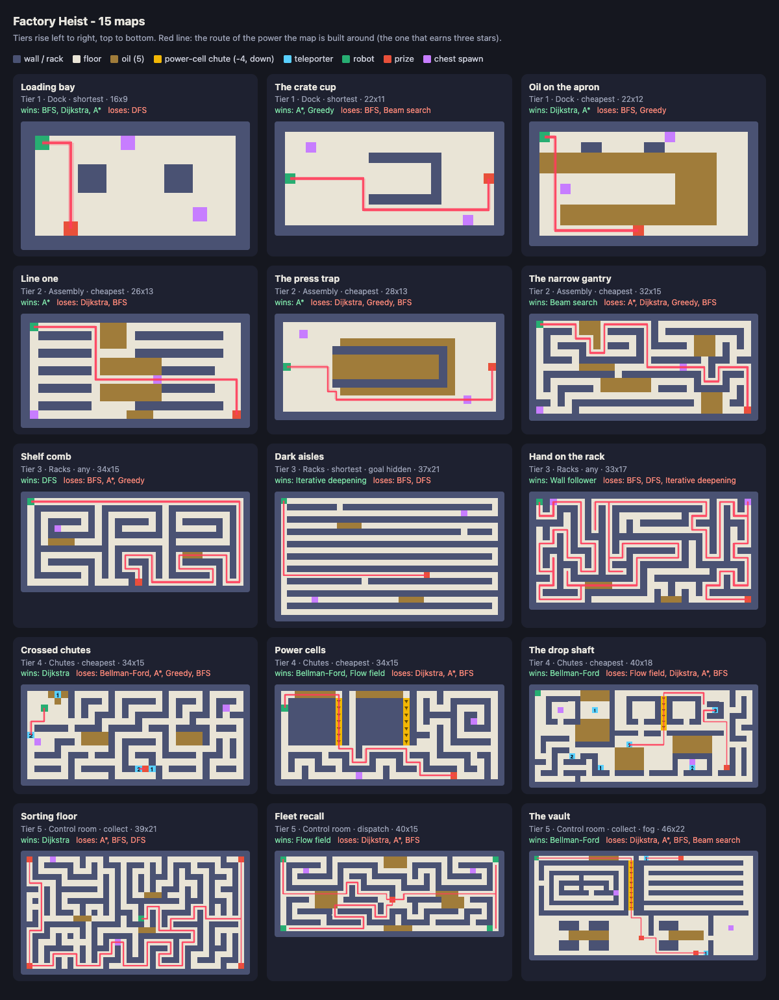

# Factory Heist maps

Fifteen maps across five factory zones, three maps per zone, getting harder in order.
They live in [`maps.js`](../../maps.js) as `MAPS`.
[`tools/verify-maps.js`](../../tools/verify-maps.js) checks every claim in this document by running the engine.

## Contract with the logic lane

`maps.js` is a plain script: no modules, no dependencies, and safe to open from `file://`.
In the browser it defines a global `MAPS`, and in node it exports `{ MAPS }`.
Each entry looks like this:

| Field | Meaning |
|---|---|
| `id` | Stable key, `<zone>-<slug>`. |
| `name` | What the player sees. |
| `zone` | `dock`, `assembly`, `racks`, `chutes` or `control`. |
| `tier` | 1-5. The zone decides it: dock 1, assembly 2, racks 3, chutes 4, control 5. |
| `objective` | Scored exactly like `levels.js`: `shortest`, `cheapest`, `any`, `collect` or `dispatch`. |
| `budgets` | `expansions` and/or `frontier`, the same way `levels.js` uses them. |
| `fog`, `goalKnown` | Optional. `fog: true` is the engine's fog. `goalKnown: false` hides the prize. |
| `expect` | Stars per power id (`search.js` registry ids) that carry the map's lesson. |
| `ascii` | The map. Every row is the same width and the outer ring is always wall. |
| `notes` | The idea the map is built around, and why one power wins and another loses. |

Glyphs are the engine's (README "Map format"), read as a factory:

| Glyph | Factory meaning | Engine meaning |
|---|---|---|
| `#` | wall, rack, crate stack, machine | wall |
| `.` | floor | cost 1 |
| `~` | oil slick | cost 5 |
| `v` | power-cell chute | cost -4, one-way downward |
| `0`-`9` | teleporter chute | pads sharing a digit are one move apart |
| `S` | robot start | start (several means several robots) |
| `G` | prize | goal (several means collect them all) |
| `$` | chest spawn point | plain floor, cost 1 |

`$` is the only glyph the engine does not already know.
`cellCost` treats unknown glyphs as cost-1 floor and `isWall` only treats `#` as a wall, so `$` needs no engine change.
The heist logic decides what spawns there.
`render.js` draws it as floor until the logic lane gives it a look.

## The fifteen maps

| Tier | Zone | Map | Objective | Size | Wins (3 stars) | Loses |
|---|---|---|---|---|---|---|
| 1 | dock | Loading bay | shortest | 16x9 | BFS, Dijkstra, A* | DFS |
| 1 | dock | The crate cup | shortest | 22x11 | A*, Greedy | BFS, Beam |
| 1 | dock | Oil on the apron | cheapest | 22x12 | Dijkstra, A* | BFS, Greedy |
| 2 | assembly | Line one | cheapest | 26x13 | A* | Dijkstra, BFS |
| 2 | assembly | The press trap | cheapest | 28x13 | A* | Dijkstra, Greedy, BFS |
| 2 | assembly | The narrow gantry | cheapest | 32x15 | Beam | A*, Dijkstra, Greedy, BFS |
| 3 | racks | Shelf comb | any | 34x15 | DFS | BFS, A*, Greedy |
| 3 | racks | Dark aisles | shortest, prize hidden | 37x21 | Iterative deepening | BFS, DFS |
| 3 | racks | Hand on the rack | any | 33x17 | Wall follower | BFS, DFS, Iterative deepening |
| 4 | chutes | Crossed chutes | cheapest | 34x15 | Dijkstra | Bellman-Ford, A*, Greedy, BFS |
| 4 | chutes | Power cells | cheapest | 34x15 | Bellman-Ford, Flow field | Dijkstra, A*, BFS |
| 4 | chutes | The drop shaft | cheapest | 40x18 | Bellman-Ford | Flow field, Dijkstra, A*, BFS |
| 5 | control | Sorting floor | collect 4 prizes | 39x21 | Dijkstra | A*, BFS, DFS |
| 5 | control | Fleet recall | dispatch 4 robots | 40x15 | Flow field | Dijkstra, A*, BFS |
| 5 | control | The vault | collect 3 prizes, fog | 46x22 | Bellman-Ford | Dijkstra, A*, BFS, Beam |

The `notes` field on each map explains its trap in a few sentences.
In short:

- **Dock** teaches the basics on open floor: steps against guesses, then oil against steps.
  The crate cup is the first map where a power (beam search) fails outright.
- **Assembly** makes the fuel budget matter.
  A* beats Dijkstra on Line one, a flooded press tempts greedy and BFS, and on the narrow gantry memory is so tight that only beam search keeps the cheapest route.
- **Racks** are mazes where memory is the budget.
  DFS wins where any route will do, iterative deepening wins when the route must be shortest and the prize is hidden, and the wall follower wins when there is no memory at all.
- **Chutes** break the ruler.
  Teleporters make every heuristic confidently wrong, and power-cell chutes make every search that closes cells early wrong too.
  The drop shaft has both at once, and its true cheapest route costs 11 where every other power settles for 32 or worse.
- **Control** puts it all together on the largest floors.
  Multi-prize collection, a four-robot recall, and finally the vault: fog, oil, a lying teleporter and a charging shaft on one map, where only Bellman-Ford brings the haul home at the true cost.

## How hard gets harder

`verify-maps.js` measures every map and prints the tier averages:

| Tier | Floor cells | Branching | Traps | Powers that earn 3 stars |
|---|---|---|---|---|
| 1 | 150 | 0.0 | 0.3 | 5.3 |
| 2 | 232 | 6.0 | 3.7 | 2.3 |
| 3 | 284 | 18.0 | 4.7 | 2.0 |
| 4 | 298 | 19.7 | 6.3 | 1.3 |
| 5 | 419 | 28.0 | 7.7 | 1.0 |

- *Branching* counts dead ends plus corridor forks (a fork inside open floor is not a choice the walls force).
- *Traps* counts oil slicks, teleporter pairs, chute runs, extra prizes, extra robots, fog, a hidden prize and a memory cap of 6 or less.
- *Powers that earn 3 stars* goes down: on the three tier-5 maps exactly one power in twelve earns three stars.

## What the verifier enforces

Run `node tools/verify-maps.js`.
It exits non-zero on any of these:

- the list is not exactly 15 maps with unique ids, 3 per zone, tiers never going down and matching their zone;
- a row is the wrong width, a glyph is unknown, or the outer wall has a gap;
- a teleporter digit is not exactly one pair, or a power-cell chute is walled off at either end;
- any robot cannot reach any prize, or any chest spawn cannot be reached from the first robot;
- two maps differ in less than 15% of their interior;
- floor, branching or traps do not rise from each tier to the next, a lower tier lets fewer powers win than tier 5, or a tier 4-5 map lets more than two powers win;
- any power pinned in `expect` earns different stars from the engine, or a map pins no winner or no loser.

Stars come from `starsFor` in `tools/verify-levels.js`, so the maps are scored exactly like the shipped levels.
The best-cost reference comes from Bellman-Ford, as in `referenceFor`, so a map with power-cell chutes is scored against the true answer.
